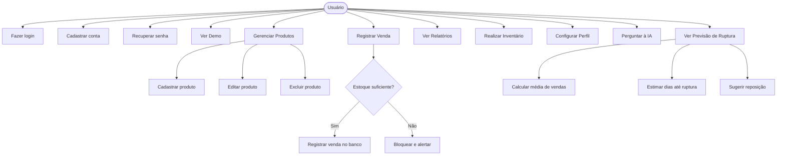

# 🛒 Prateleira — Sistema de Gestão de Estoque Inteligente

**Prateleira** é um sistema web moderno de gestão de estoque voltado para mini-mercados, mercearias e pequenos negócios de varejo. Simples de usar, com alertas automáticos e assistente de Inteligência Artificial integrado.

---

## 📌 Problema Real

Pequenos comerciantes frequentemente perdem vendas por falta de controle de estoque: não sabem quando repor produtos, não identificam tendências de consumo e gastam tempo contando itens manualmente. O Prateleira resolve isso com tecnologia acessível e IA.

## 👥 Público-Alvo

- Donos de mini-mercados, mercearias e armazéns
- Pequenos varejistas que ainda controlam estoque em cadernos ou planilhas
- Negócios com 10–200 produtos em estoque

## 🎯 Objetivo

Oferecer um sistema de gestão de estoque gratuito, fácil de usar em qualquer dispositivo, com alertas automáticos de reposição e análise preditiva por IA.

## 💡 Proposta de Valor

> "Saiba quando repor antes de acabar — com IA que analisa suas vendas."

---

## ✨ Funcionalidades

| Funcionalidade | Descrição |
|---|---|
| 📦 **Gestão de Produtos** | Cadastro, edição, exclusão e busca de produtos com código, categoria e preço |
| 💰 **Registro de Vendas** | Nova venda com dedução automática e atômica do estoque |
| 📊 **Relatórios** | Gráficos de vendas por dia, categorias, top produtos e risco de ruptura |
| 🔔 **Alertas de Estoque** | Notificações automáticas quando o estoque cai abaixo do mínimo |
| 📋 **Inventário** | Fluxo completo de contagem física com registro de ajustes e motivo |
| 🤖 **Assistente de IA** | Chat com Google Gemini com contexto completo do seu negócio |
| 🔮 **Previsão de Ruptura** | Calcula risco por produto: dias restantes, média de vendas diária e sugestão de reposição |
| 🔐 **Autenticação** | Login por e-mail, cadastro com verificação de e-mail, recuperação de senha e Google OAuth |
| 🎭 **Modo Demo** | Explore o sistema com dados simulados sem precisar criar conta |

### Onde entra a IA

- **Previsão de Ruptura** (local, offline): calcula para cada produto a média de vendas diária, os dias estimados até o estoque acabar e o nível de risco (baixo, médio, alto, crítico).
- **Chat com Gemini**: o assistente recebe o contexto completo do estoque e das previsões de risco, respondendo perguntas em linguagem natural sobre o negócio.

---

## 🛠️ Stack Técnica

| Camada | Tecnologia |
|---|---|
| Frontend | React 18 + TypeScript + Vite |
| Estilização | Tailwind CSS |
| Animações | Framer Motion (motion/react) |
| Gráficos | Recharts |
| Backend/BaaS | Supabase (PostgreSQL + Auth + RLS) |
| IA | Google Gemini API (`gemini-2.0-flash`) |
| Icons | Lucide React |
| Toast | Sonner |

---

## 🚀 Como Rodar Localmente

### Pré-requisitos
- Node.js 18+
- Conta no [Supabase](https://supabase.com) (gratuita)
- Chave de API do [Google AI Studio](https://aistudio.google.com/app/apikey) (opcional, mas recomendada)

### 1. Clonar o repositório

```bash
git clone https://github.com/anleaes/2026-1-EDTF-Quinta-Sexta-Manha-ZS-01.git
cd 2026-1-EDTF-Quinta-Sexta-Manha-ZS-01/Projeto_Prateleira_01
```

### 2. Instalar dependências

```bash
npm install
```

### 3. Configurar variáveis de ambiente

```bash
cp .env.example .env.local
```

Edite `.env.local` com suas credenciais (veja seção abaixo).

### 4. Iniciar o servidor de desenvolvimento

```bash
npm run dev
```

Acesse: `http://localhost:5173`

---

## ⚙️ Configurar Supabase

1. Crie um projeto gratuito em [supabase.com](https://supabase.com)
2. No painel do projeto, vá em **SQL Editor**
3. Copie e execute o conteúdo do arquivo [`supabase_schema.sql`](./supabase_schema.sql)
4. Vá em **Project Settings > API** e copie:
   - `Project URL` → `VITE_SUPABASE_URL`
   - `anon public key` → `VITE_SUPABASE_ANON_KEY`
5. Em **Authentication > Email Templates**, habilite a confirmação de e-mail se desejar

---

## 🤖 Configurar Gemini (IA)

1. Acesse [aistudio.google.com/app/apikey](https://aistudio.google.com/app/apikey)
2. Clique em **Create API key** e copie a chave gerada
3. Adicione ao `.env.local`:

```env
VITE_GEMINI_API_KEY=AIza...sua-chave-aqui
```

4. Reinicie o servidor (`npm run dev`)

> **Sem a chave**: o assistente funciona em modo offline com análise local dos dados do estoque.

---

## ☁️ Deploy na Vercel

1. Faça fork ou push do projeto para o GitHub
2. Acesse [vercel.com](https://vercel.com) e importe o repositório
3. Defina as variáveis de ambiente no painel da Vercel:
   - `VITE_SUPABASE_URL`
   - `VITE_SUPABASE_ANON_KEY`
   - `VITE_GEMINI_API_KEY`
4. Clique em **Deploy**

> O projeto é compatível com Vercel por padrão (SPA com Vite). Nenhuma configuração adicional é necessária.

---

## 📁 Estrutura do Projeto

```
src/
├── app/              # Roteamento principal (App.tsx)
├── components/       # Componentes reutilizáveis
│   ├── common/       # StatsCard, etc.
│   ├── features/     # Componentes por feature (ai, dashboard, sales...)
│   └── layout/       # Header, Sidebar
├── context/          # AuthContext, StoreContext
├── data/             # mockData.ts (modo demo)
├── hooks/            # Hooks customizados
├── integrations/     # Supabase client, AI service, Stock Forecast
├── layouts/          # DashboardLayout
├── pages/            # Páginas da aplicação
├── services/         # Serviços (auth, product, sales, stock)
├── types/            # Interfaces e tipos TypeScript
└── utils/            # Funções utilitárias
```

---

## 📚 Atividade A3 — Documentação Acadêmica

### Identificação

- **Projeto:** Prateleira — Sistema de Gestão de Estoque com IA
- **Turma:** EDTF Quinta/Sexta Manhã — ZS-01 (2026.1)
- **Repositório:** [GitHub](https://github.com/anleaes/2026-1-EDTF-Quinta-Sexta-Manha-ZS-01)

---

### Requisitos Funcionais (RF)

| ID | Requisito |
|----|-----------|
| RF01 | O sistema deve permitir cadastro de usuário com e-mail e senha |
| RF02 | O usuário deve confirmar o e-mail antes de acessar o sistema |
| RF03 | O sistema deve permitir recuperação de senha por e-mail |
| RF04 | O usuário deve poder cadastrar, editar e excluir produtos |
| RF05 | O sistema deve registrar vendas e deduzir o estoque automaticamente |
| RF06 | O sistema deve impedir venda acima da quantidade disponível |
| RF07 | O sistema deve exibir alertas quando o estoque atingir o mínimo |
| RF08 | O sistema deve permitir realizar inventário físico com registro de ajustes |
| RF09 | O sistema deve exibir relatórios de vendas por período e por produto |
| RF10 | O assistente de IA deve responder perguntas sobre estoque e vendas |
| RF11 | O sistema deve calcular previsão de ruptura de estoque por produto |
| RF12 | O sistema deve oferecer modo demonstração sem necessidade de login |

### Requisitos Não Funcionais (RNF)

| ID | Requisito |
|----|-----------|
| RNF01 | O sistema deve funcionar em dispositivos móveis (responsivo) |
| RNF02 | O tempo de resposta das operações de CRUD deve ser < 2 segundos |
| RNF03 | Os dados de cada usuário devem ser isolados dos demais (RLS) |
| RNF04 | Chaves de API e senhas nunca devem ser enviadas ao repositório |
| RNF05 | O sistema deve manter a sessão do usuário mesmo após recarregar a página |
| RNF06 | O assistente de IA deve funcionar sem API key (modo offline) |
| RNF07 | O build de produção deve funcionar sem erros de TypeScript |

---

### Diagrama de Casos de Uso



---

### Roteiro de Investigação (Lean Startup / Design Thinking)

**Problema investigado:** Pequenos comerciantes não sabem quando repor produtos e só percebem a falta quando o cliente pede e não tem.

**Hipóteses levantadas:**
1. O comerciante não tem tempo para analisar planilhas complexas.
2. Um alerta simples de "estoque baixo" já mudaria o comportamento de compra.
3. A previsão baseada em histórico de vendas é mais útil que o mínimo fixo.

**Método de investigação:**
- Entrevistas com 3 donos de mercadinhos na região.
- Observação do fluxo atual (caderno, planilha Excel).
- Teste de usabilidade com protótipo navegável.

---

### Premissa de Maior Risco

> "O usuário vai registrar as vendas no sistema todos os dias, mantendo o histórico atualizado para que a IA funcione bem."

**Risco:** Se o usuário não registrar as vendas regularmente, o estoque ficará desatualizado e a previsão de IA perderá precisão.

---

### Como o MVP Testa Esta Premissa

- O MVP inclui um formulário rápido de "Nova Venda" (máximo 3 campos).
- A interface mostra imediatamente o estoque atualizado após cada venda.
- O modo Demo demonstra o valor do sistema com dados realistas de 3 meses.
- A métrica de validação: após 2 semanas de uso, o usuário registra > 80% das vendas no sistema.

---

### Ética e LGPD

| Ponto | Implementação |
|-------|---------------|
| Dados pessoais mínimos | Coleta apenas nome, e-mail e dados da loja |
| Consentimento | Confirmação de e-mail obrigatória no cadastro |
| Isolamento de dados | Row Level Security (RLS) no Supabase garante que cada usuário vê apenas seus dados |
| Segurança das chaves | `.env.local` no `.gitignore`, nunca versionado |
| Direito de exclusão | Conta pode ser excluída via painel do Supabase |
| Dados de IA | Nenhum dado é enviado ao Gemini sem consentimento do usuário (interação explícita no chat) |

---

### Validação com 5 Usuários (Planejada)

| # | Perfil | Método | Objetivo |
|---|--------|--------|----------|
| 1 | Dono de mercearia, 50 anos, sem experiência técnica | Teste de usabilidade presencial | Consegue cadastrar produto e registrar venda em < 3 min? |
| 2 | Funcionário de mini-mercado, 25 anos | Teste remoto (loom) | Entende os alertas de estoque baixo sem explicação? |
| 3 | Estudante universitário gerenciando cantina | Autoatendimento + questionário | O modo Demo é convincente o suficiente para criar conta? |
| 4 | Dona de armazém, 40 anos | Entrevista + observação | Usa o assistente de IA espontaneamente? |
| 5 | Comerciante com planilha atual | Comparativo | Prefere o Prateleira à planilha? Por quê? |

**Métricas de sucesso:**
- Taxa de conclusão da tarefa "cadastrar produto + registrar venda": > 80%
- SUS (System Usability Scale): > 70/100
- Intenção de uso após 1 semana: > 60% dos entrevistados

---

## 📋 Próximos Passos

- [ ] Exportação de relatórios em PDF/CSV
- [ ] Notificações push (PWA)
- [ ] Multi-loja / multi-usuário por loja
- [ ] Integração com leitora de código de barras
- [ ] Previsão de demanda com ML (scikit-learn ou Vertex AI)
- [ ] App mobile (React Native / Expo)

---

## 📝 Licença

Este projeto foi desenvolvido para fins acadêmicos na disciplina de Empreendedorismo Digital e Tecnologia — EDTF (2026.1).